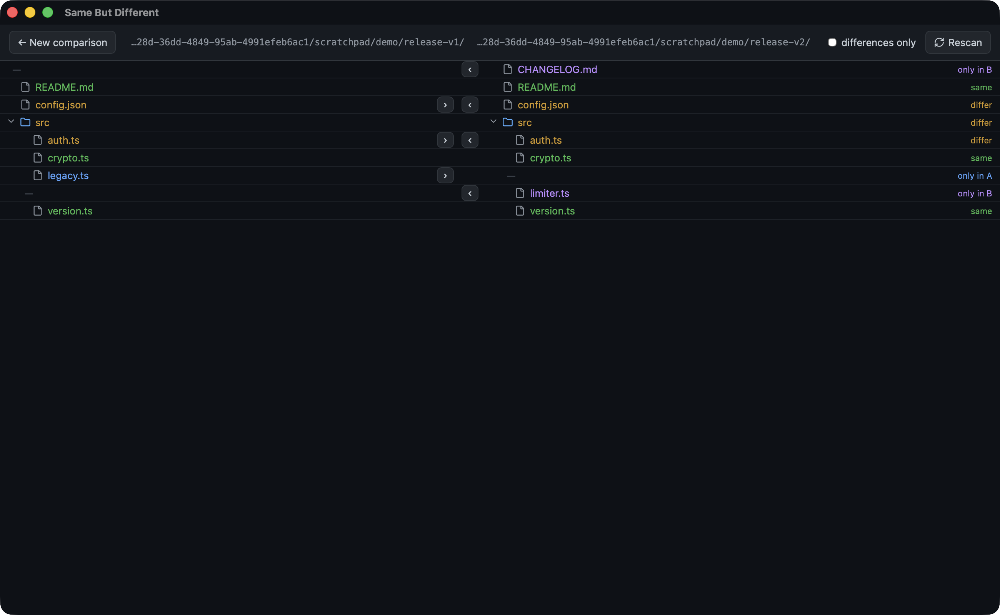
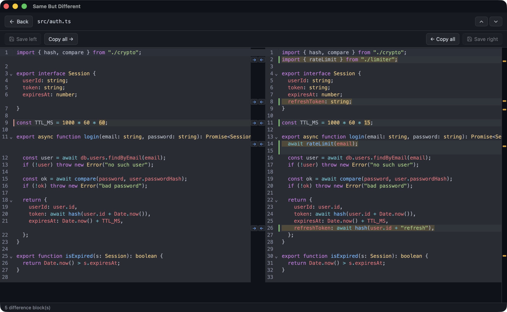
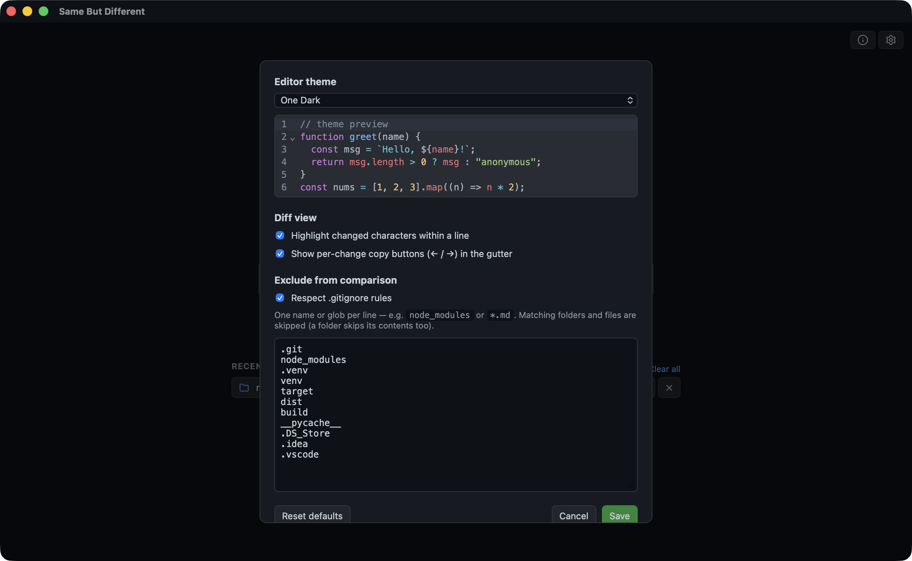

# Same But Different

A desktop app for comparing folders and files. Point it at two directories, see exactly
what changed, and copy the differences across — line by line or whole files at a time.

Free, open source, and runs on macOS, Windows, and Linux.



## Install

Download the file for your platform from the [latest release](https://github.com/kalsky/sameButDifferent/releases/latest).

| Platform | File |
| --- | --- |
| macOS (Intel + Apple Silicon) | `*-darwin-universal-dmg.dmg` |
| Windows | `*-windows-x86_64-nsis-setup.exe` or `*-msi.msi` |
| Linux | `*-linux-x86_64-appimage.AppImage` or `*-deb.deb` |

These builds are **unsigned**, so your system will warn you the first time you open it:

- **macOS** — "cannot be opened because the developer cannot be verified." Right-click
  the app → **Open** → **Open**. Or run `xattr -cr /Applications/SameButDifferent.app`.
- **Windows** — SmartScreen shows "Windows protected your PC." Click **More info** →
  **Run anyway**.
- **Linux** — make the AppImage executable first: `chmod +x SameButDifferent-*.AppImage`.

Signing certificates cost money and this is a free tool. If you'd rather not trust a
binary, [build it yourself](DEVELOPER.md) — it's two commands.

## Using it

### Compare two folders

Pick **Folders** on the home screen, choose a directory for each side, and hit compare.
You get a merged tree where every row is colour-coded:

| Colour | Meaning |
| --- | --- |
| 🟢 Green | Identical on both sides |
| 🟠 Orange | Exists on both sides, contents differ |
| 🔵 Blue | Only on the left |
| 🟣 Purple | Only on the right |

Folders roll up their contents, so a collapsed directory showing orange means something
inside it changed. Click any differing file to open it side by side.

### Compare two files

Pick **Files** instead to jump straight into a diff of two specific files — handy when
they have different names or live in unrelated places.



The file view gives you:

- **Syntax highlighting**, picked automatically from the file extension
- **Copy chevrons** (← →) in the centre gutter to move a single change to the other side
- **Direct editing** on either side — it's a real editor, not a static view
- **A minimap** on the right showing every difference in the file; click a tick to jump
- **Up/down arrows** to step through changes one at a time

Nothing is written to disk until you press **Save**. Close with unsaved edits and it
asks first.

### Files that aren't text

- **Images** render side by side.
- **PDFs** render side by side using your system's PDF viewer.
- **Binaries** open as a paged hex dump, so you can still see where bytes diverge.

### Skipping files you don't care about

Open **Settings** (⚙️, top right) to control what gets compared.



**Exclude list** — one entry per line, either a plain name or a glob:

```
node_modules      skips any folder or file with that exact name
*.log             skips every file ending in .log
.DS_Store         skips those files everywhere in the tree
```

Excluding a folder skips everything inside it. Sensible defaults come preloaded
(`.git`, `node_modules`, `target`, `dist`, `__pycache__`, and friends) — **Reset
defaults** brings them back if you overwrite them.

**Respect .gitignore** — on by default. When enabled, files your `.gitignore` excludes
are left out of the comparison. Turn it off to see everything.

> One gotcha worth knowing: `.gitignore` only takes effect inside an actual git
> repository, and it applies to each side independently. If you compare a git checkout
> against a plain copied folder, the checkout side gets filtered and the copy doesn't —
> which makes identical files look like they only exist on one side. If a comparison
> looks wrong, this toggle is the first thing to check.

### Other settings

- **Editor theme** — a set of light and dark themes, with a live preview.
- **Highlight changed characters** — marks the exact characters that differ within a
  changed line, not just the whole line.
- **Show copy buttons** — hide the gutter chevrons if you want a read-only feel.

Settings and your recent comparisons persist between launches. The home screen keeps a
list of recent pairs so you can jump back into one with a click.

## Good to know

- **Comparison is fast on big trees** because it avoids reading files it doesn't need
  to. Different sizes settle it immediately; matching size and timestamp is assumed
  identical; only genuine ambiguity falls through to hashing both files.
- **Saves are atomic.** Changes are written to a temporary file and then swapped into
  place, so a crash or a full disk can't leave you with a half-written file.
- **Matching is by name and path.** A file that was renamed or moved shows up as one
  deletion plus one addition, not as a rename.
- **Two-way only** for now. Three-way comparison is planned.

## Contributing

Bug reports and pull requests are welcome. See [DEVELOPER.md](DEVELOPER.md) for
setup, tests, and how the internals fit together.

## License

[MIT](LICENSE) — © Yaniv Kalsky
